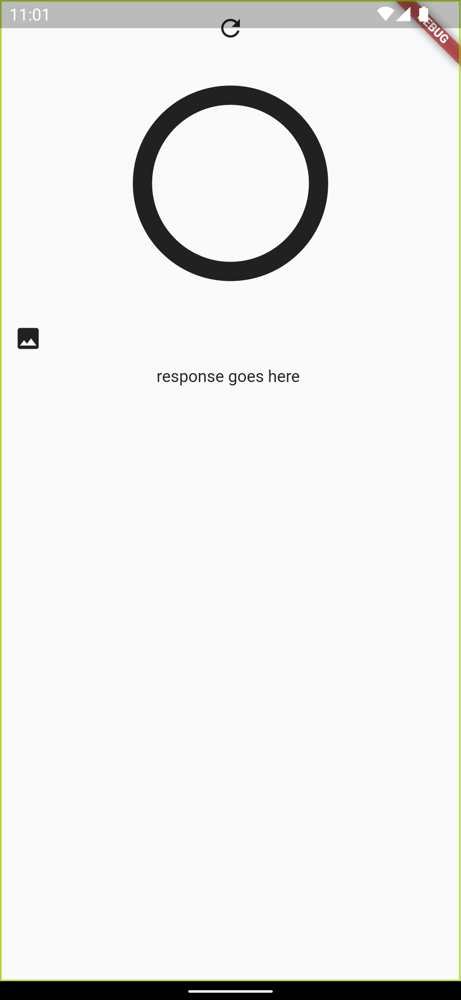
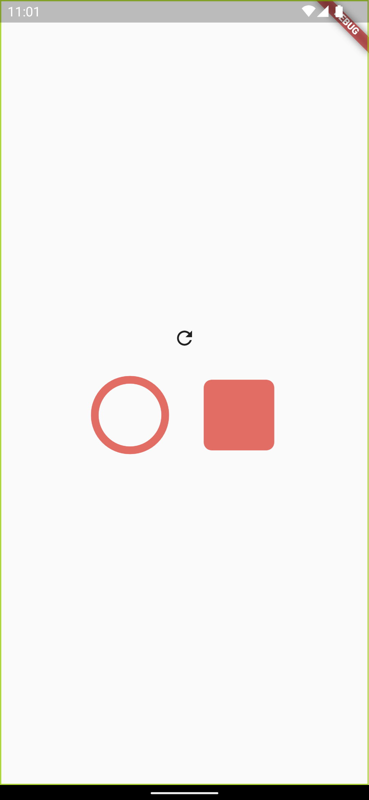
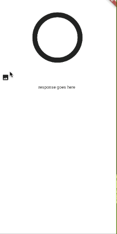
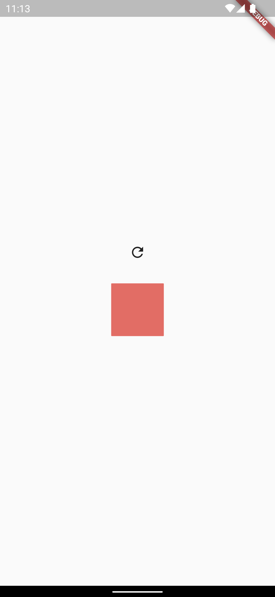

# THETA X Concept 5

This project focuses on getting the captureMode as soon as the application builds. The objective is to change the application's button to either picture or video mode depending on the camera's initial state. 

For example, if the camera is on picture mode, the screen should look like this: 


If the camera is on video mode, the screen changes to this:


In order to implement this feature, the `GetModeEvent` runs under the `BlocBuilder` in the main file. Every time the project builds, the application gets the mode of the camera. 

```dart
child: MaterialApp(
        home: BlocBuilder<CameraUseBloc, CameraUseState>(
          builder: (context, state) {
            context.read<CameraUseBloc>().add(GetModeEvent());}))
```

Next, if the mode is equal to `image`, the application will display the `ImageScreen`. Alternatively, if the mode is equal to `video`, the application will display the `VideoScreen`. Else, there is a `RefreshScreen`.

```dart
 if (state.captureMode == 'image') {
              return const ImageScreen();
            } else if (state.captureMode == 'video') {
              return const VideoScreen();
            } else {
              return const RefreshScreen();
            }
```

## 6/28/22

An IconButton displays the last thumbnail for an image. The variable inside of the State called `showImage` is set to true inside of the `GetPictureEvent`. If the `showImage` variable is true and there is a `fileUrl`, the application is intended to display the thumbnail image.

```dart
   return Expanded(
            child: context.watch<CameraUseBloc>().state.showImage &&
                    context.watch<CameraUseBloc>().state.fileUrl.isNotEmpty
                ? InkWell(
                    child: Image.network('${state.fileUrl}?type=thumb'),
                  )
                : Text('response goes here '));
```

However, this was not the case as the `GetModeEvent` runs after the code rebuilds. The `GetModeEvent` overrides the state and emits `showImage` as false. Thus, when the IconButton is expected to display the image, the application just displays the Text. 

The current solution is to check if `showImage` is true within the `GetModeEvent` and then run the code to get the `fileUrl`. Next, emit the State with `showImage` set to true and the `fileUrl`. Although this solution showed the thumbnail image, the code is lengthy and not the best implementation of Bloc structure. 

```dart
 on<GetModeEvent>((event, emit) async {
      var response = await thetaService.command({
        'name': 'camera.getOptions',
        'parameters': {
          'optionNames': ['captureMode']
        }
      });
    ...
    if (state.showImage) {
       ...
        var fileUrl = convertResponse['results']['entries'][0]['fileUrl'];
        emit(CameraUseState(
            message: response.bodyString,
            captureMode: captureMode,
            fileUrl: fileUrl,
            showImage: true));
```



## 6/29/2022

The project was separated into 3 separate Blocs(`camera_use`, `image_screen`, and `video_screen`). The `camera_use` Bloc holds the `GetModeEvent`, the `image_screen` Bloc holds the `TakePicEvent` and `GetPicEvent`, and the `video_screen` has the `StartCaptureEvent` and `StopCaptureEvent`. 

When the video starts/stops, the `IconButton` changes shape to match the video's State. 




After separating the functionality of the application into the 3 Blocs, the application was intended to run the same. However, there was a problem after merging the branches that the thumbnail button didn't update the response image after the shutter button was pressed. Additionally, if the shutter button is pressed before the thumbnail button, no images will appear. 